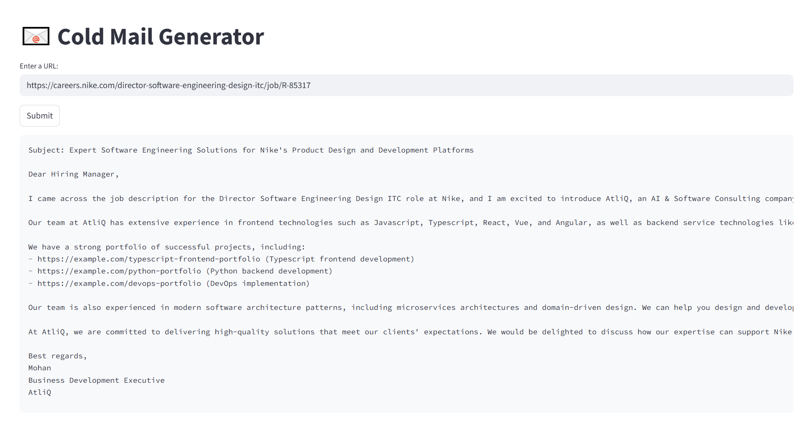

# Cold-Email-Generator-RAG-based-project
# 📧 Gen AI Cold Email Generator for B2B Sales

An end-to-end **Retrieval-Augmented Generation (RAG)** application designed to automate the creation of personalized cold emails for B2B sales. This tool helps software and consulting companies streamline their outreach by scraping job descriptions, extracting key skills, and matching them with relevant service portfolios to draft highly targeted emails.

## 📸 Application Screenshot


## 🚀 Features & Workflow
1. **Data Extraction**: Takes a job posting URL and scrapes the page content using LangChain's `WebBaseLoader`.
2. **Intelligent Analysis**: Parses the scraped text to create a structured JSON object containing the required job skills and role descriptions.
3. **RAG Pipeline & Contextual Matching**: Queries a ChromaDB vector store to perform a semantic search, retrieving specific, relevant portfolio links based on the identified skills.
4. **Email Generation**: Constructs a professional, highly-tailored cold email by augmenting the LLM with the retrieved portfolio context and extracted job details to effectively pitch your services.

## 🛠️ Tech Stack
* **Architecture**: **Retrieval-Augmented Generation (RAG)** to ground LLM responses in specific, relevant company data.
* **LLM**: Llama 3.1 (70B) via **Groq API** for ultra-fast, high-speed inference.
* **Vector Database**: **ChromaDB** for semantic search and storing company portfolio/case study data.
* **Orchestration**: **LangChain** for chaining AI prompts, scraping, and database queries.
* **Frontend/UI**: **Streamlit** for a clean, user-friendly, and interactive web interface.

## ⚙️ Installation & Setup

* **Clone the repository**

```bash
git clone <repository-url>
cd <project-folder>
```

* **Install dependencies**

```bash
pip install -r requirements.txt
```

* **Set up environment variables**

Create a `.env` file in the root directory and add your Groq API key:

```env
GROQ_API_KEY=your_groq_api_key_here
```

* **Run the application**

```bash
streamlit run app.py
```

* **Open the application**

After running the command, Streamlit will display a local URL (usually `http://localhost:8501`). Open it in your browser.

## 📋 Prerequisites

* Python 3.9+
* pip
* Groq API Key

## 🛠 Troubleshooting

* If dependencies fail to install:

```bash
pip install --upgrade -r requirements.txt
```

* If `streamlit` is not recognized:

```bash
pip install streamlit
```

* Ensure the `.env` file is placed in the project root and contains:

```env
GROQ_API_KEY=your_groq_api_key_here
```


